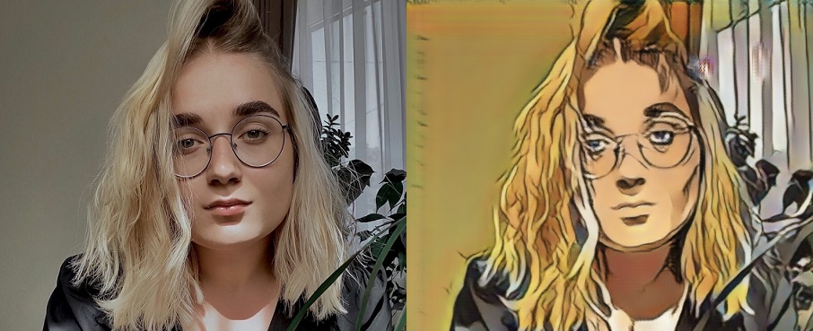
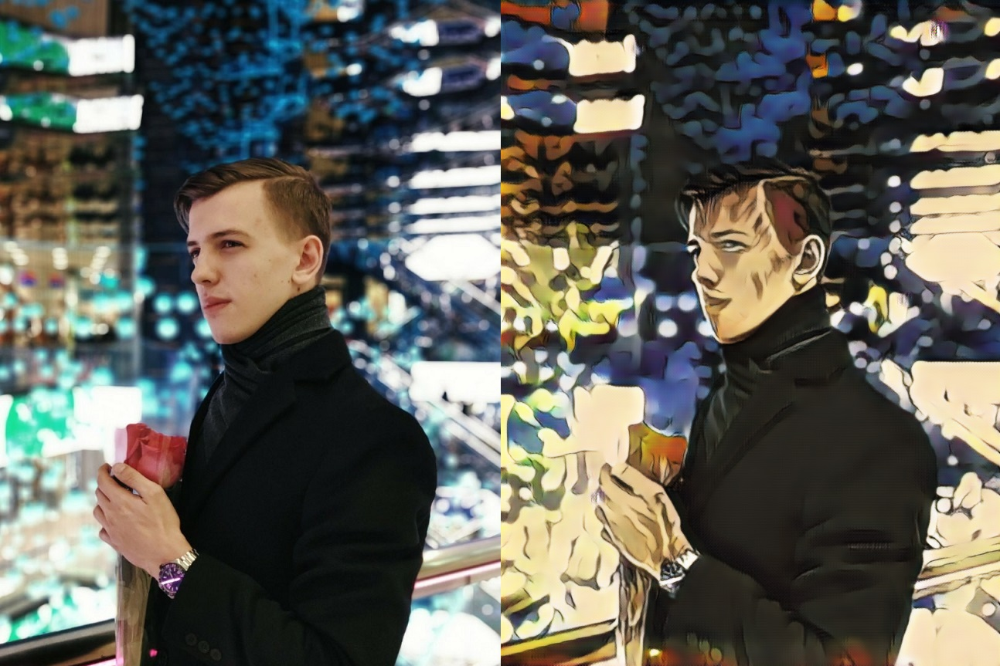
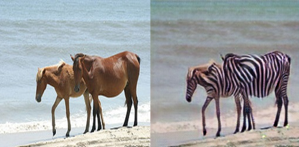
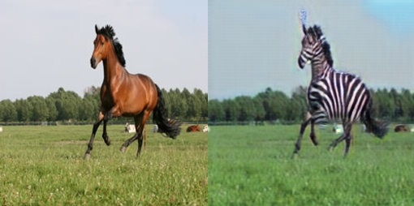

# Введение

Выбранная задача - перенос на фотографии стиля изображений персонажей аниме JoJo's Bizarre Adventure с помощью [CycleGAN](https://arxiv.org/pdf/1703.10593.pdf).
Перед выполнением основной задачи была в некотором виде выполнена задача междоменного переноса horse to zebra.

Пользоваться предлагается следующим образом:  
1) скачиваете конкретный датасет с помощью load_datasets (в папке packages), создаете dataloader через функцию pytorch.  
2) создаете модель: models.CycleGAN  
3) обучаете с помощью train.train  
рекомендуется использовать GPU для ускорения обучения. Примеры пользования - в папке examples.  

# Примеры генерации на тестовых данных:
Результаты трансформации бота могут отличаться, т.к. специально для деплоя архитектура была сжата ради экономии оперативной памяти.

1-е изображение - сгенерированное, 2-е - подаваемое на вход
#### Real to Jojo  

#### Horse to zebra  

Больше примеров - в папке examples/results

Реализация бота - в папке deploy

